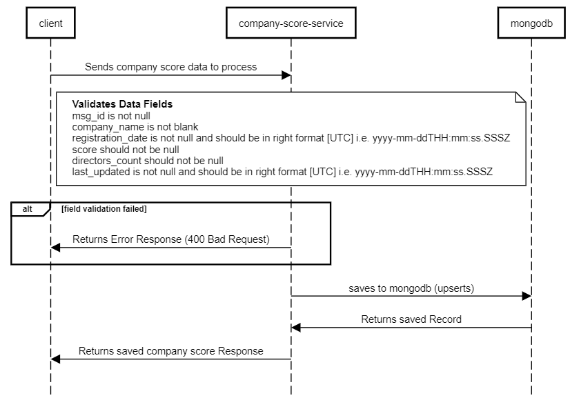

# Company Score Service
`Company Score` API endpoint which requires JSON messages to be consumed and saved to the db

# Initial Whiteboarding/Sequence Diagramming


# Pre-requisites / Tech
- Java 11
- Groovy
- Gradle
- Spring Boot 2.6.3
- Lombok
- MongoDB

# Tests
- unit tests
- mock tests (mocked integration tests)

# Assumptions made
1. It's a PUT endpoint as we are doing upsert (Create and Update)
2. All the fields are required field
3. Validation Format for Date Time fields that they need to be all coming in UTC and not in any other formats. The `mock-tests` showcases that.
4. It's a single resource upsert instead of batch upsert
5. The `msg_id` is not auto generated field
6. The date times are stored as a `Zoned Date Time`

# Could Have's
1. Using open api to document the endpoint
2. TestContainer which uses a docker environment to spin up mongodb for the tests (However using `flapdoodle` dependency to spin up mongo). Don't want tests to depend on docker
3. Discussion on best practices on this upsert endpoint (i.e. having 2 endpoints that does update and create endpoint)
4. Could have used PostGres for relational matters and Transactional rollbacks
5. Prometheus Metrics exposed so that we can capture details around the endpoint

# How to run project
* This project is dependent on mongodb, use whatever tool works for you in order to run mongodb. So there is a `docker-compose.yml` file at the root of the project
```
docker-compose up -d
```
* if docker-compose does not work, could use `docker run --name mongodb -d -p 27017:27017 mongo`
* use `./gradlew clean build` to clean, build and install dependencies
* run `Application` or use `./gradlew bootRun` command

## Testing Endpoint
```
curl -X PUT 'http://localhost:8080/company-score/v1/scores' \
--header 'Content-Type: application/json' \
--data-raw '{
"msg_id": 14,
"score": 55.8,
"company_name": "test",
"registration_date": "2020-10-27T14:34:15.333Z",
"directors_count": 3,
"last_updated": "2020-10-27T14:34:06.315Z"
}'
```
